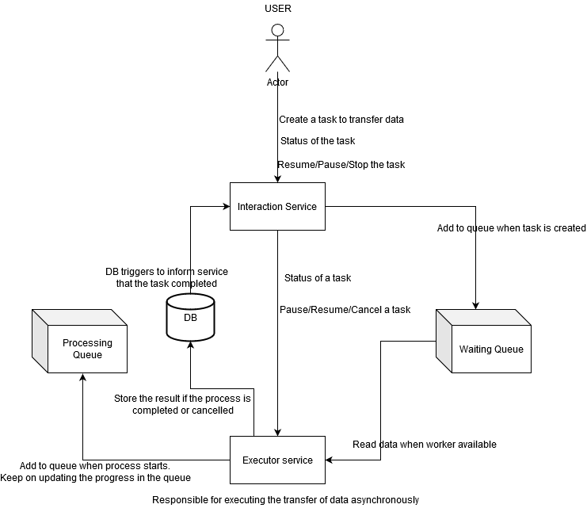

# Process Bender

### Desired Architecture
Event driven system 

\* I was unable to do this with django due to limitations around django's synchronous behaviour and celery's limitations with pub/sub model with redis *